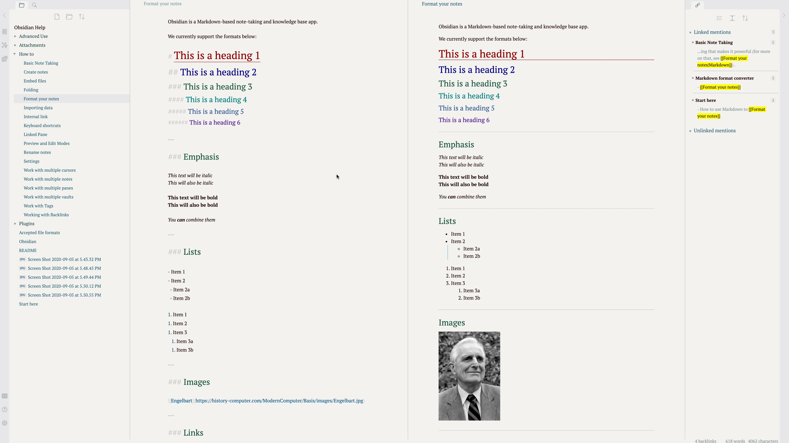
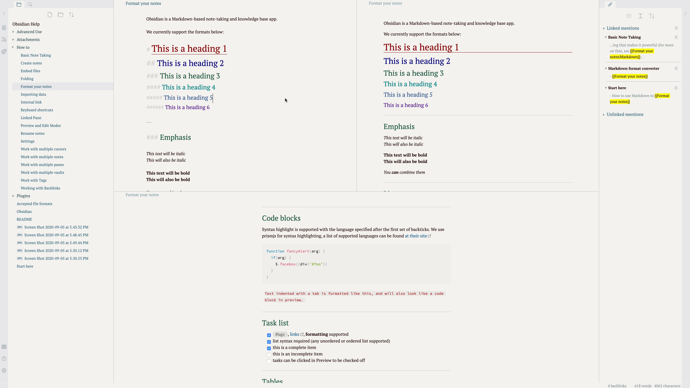
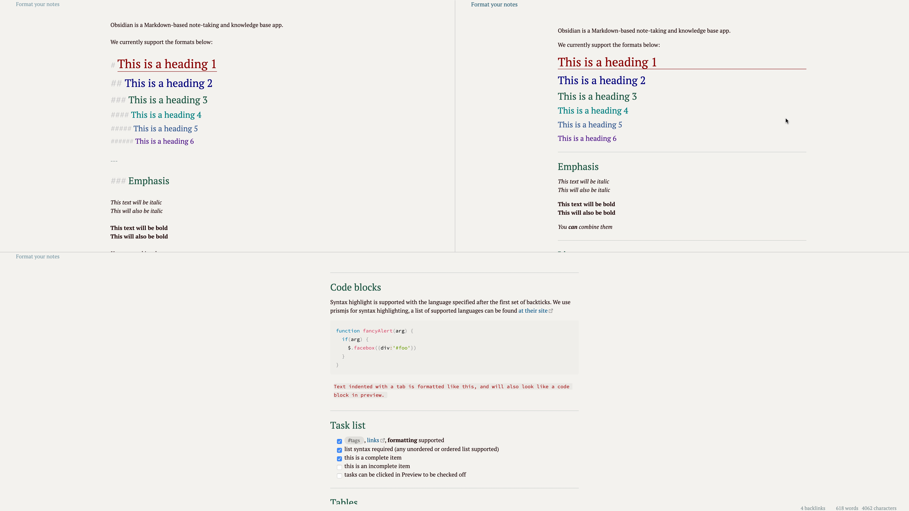
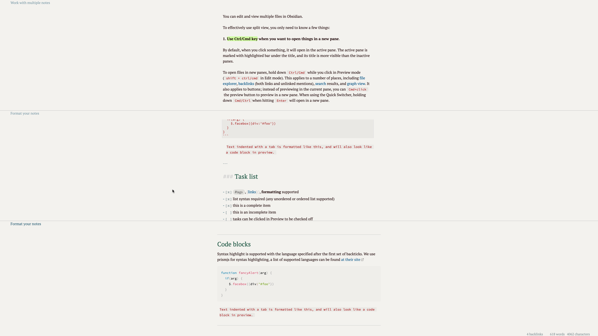
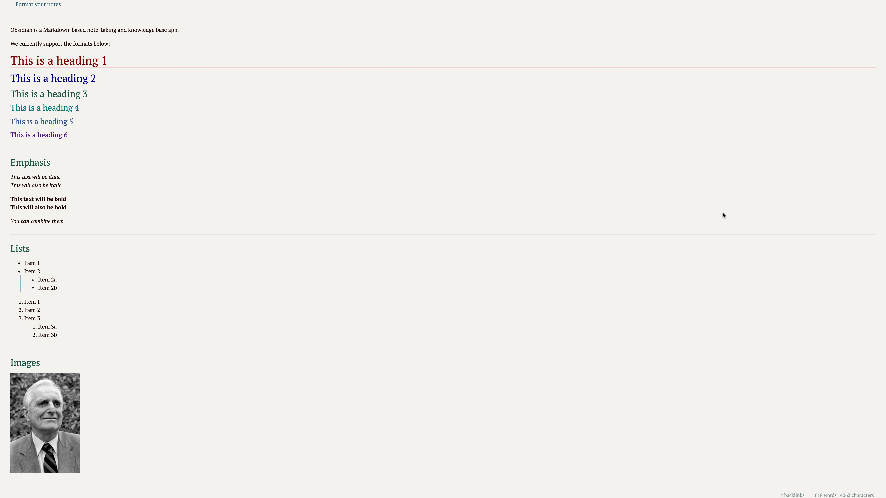
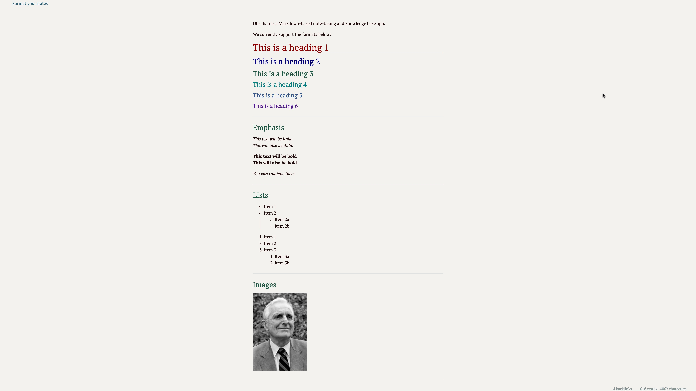
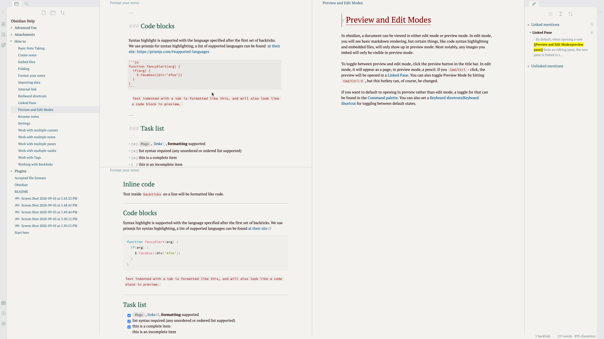
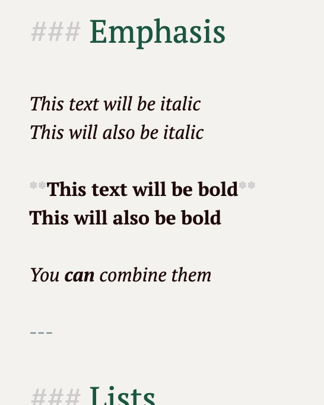

# Obsidian-simple-Theme
This is a theme made for the note taking program called Obsidian. 

# Why?
- This project was first made because I didnt want the full markdown experience in the edit-mode of obsidian. 
# Where is this Useful?
- This project is only useful with the obsidian note taking program. 

# How do I install it?
- You can use this .css file to replace the current one inside your existing vault. It will update the vault with these settings. 
- If you have trouble when you first try it, open and close your vault. 

# Who Created This?
- I alone created this project. However, this project includes amazing tweaks that were made by multiple users in the obsidian forum. Thanks to all of them that this project was made possible. P.S. i would name them but they are too many to name and i forgot how many i used 

---

